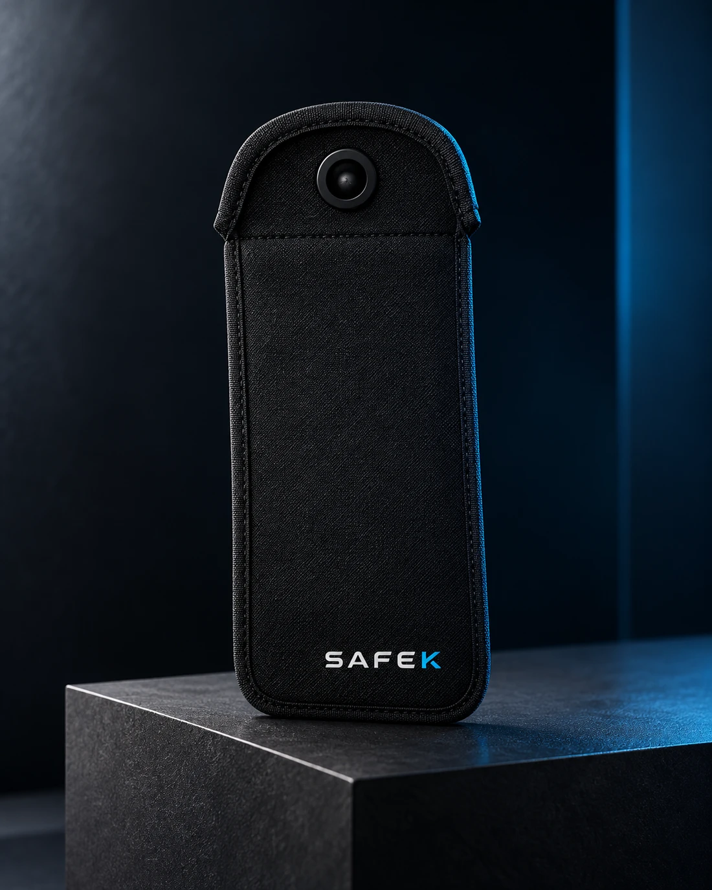

# SAFE-K — presença para o que realmente importa




Redesign completo do site institucional da **SAFE-K**, solução para armazenamento seguro de celulares em escolas, empresas, eventos e outros ambientes que valorizam foco, privacidade e presença.

## O desafio

Organizar uma proposta aplicável a públicos muito diferentes sem perder clareza de marca. O site também precisava explicar o produto, transmitir confiança para decisões B2B e funcionar bem em dispositivos de qualquer tamanho.

## A solução

- identidade visual em preto, azul-marinho e azul vivo;
- arquitetura com 19 páginas reais e navegação consistente;
- experiência mobile-first com imagens responsivas;
- diretório “Onde usar” com busca, filtros e oito contextos;
- páginas específicas para escolas, universidades, empresas, eventos, festas, tribunais, acampamentos e hospitais;
- área editorial, perguntas frequentes e fluxo de contato;
- formulário que prepara uma mensagem editável sem enviar dados automaticamente;
- tipografia Manrope hospedada localmente.

## Tecnologias

`HTML semântico` · `CSS responsivo` · `JavaScript` · `Node.js` · `Playwright` · `Vercel`

## Arquitetura

- `src/content.cjs`: conteúdo das aplicações, dúvidas e leituras;
- `src/templates.cjs`: páginas, navegação, rodapé e contato;
- `styles.css` e `app.js`: apresentação e interações;
- `assets/`: imagens otimizadas e fontes locais;
- `build.cjs`: geração das páginas e redirecionamentos;
- `tools/review-v2.cjs`: revisão automatizada de layout e comportamento.

## Executando localmente

```bash
npm install
npm start
```

Acesse `http://localhost:3014`.

Para gerar e revisar o site:

```bash
npm run build
npm run check
```

## Qualidade verificada

A suíte de revisão percorre as 19 páginas em quatro larguras — 320, 390, 768 e 1440 px — totalizando **76 cenários**. Ela verifica menus, busca, filtros, FAQ, formulário, links, imagens, erros JavaScript e problemas de layout.

---

Projeto de estratégia de conteúdo, UI/UX e desenvolvimento frontend para a SAFE-K.
